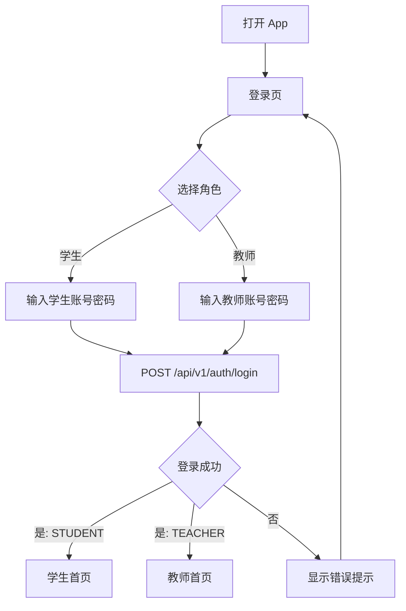
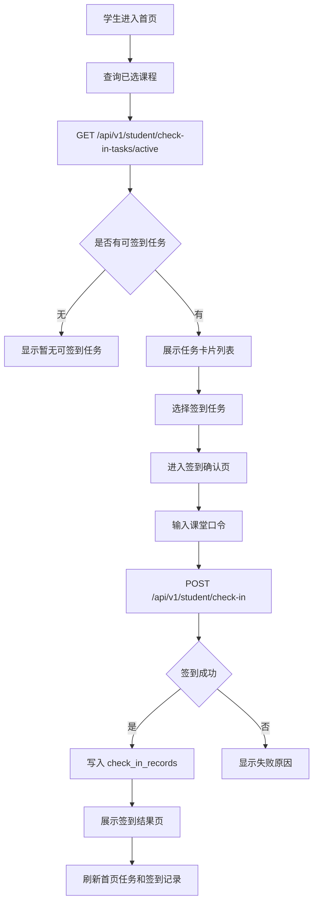
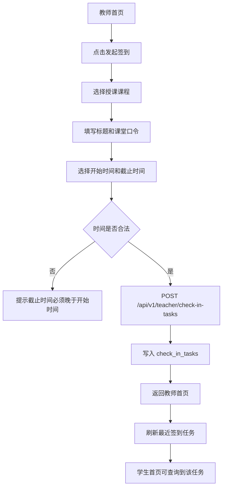
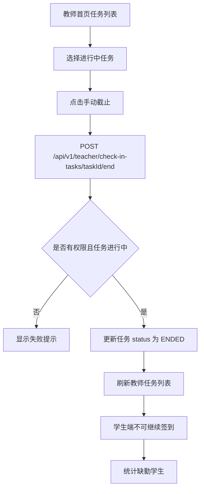
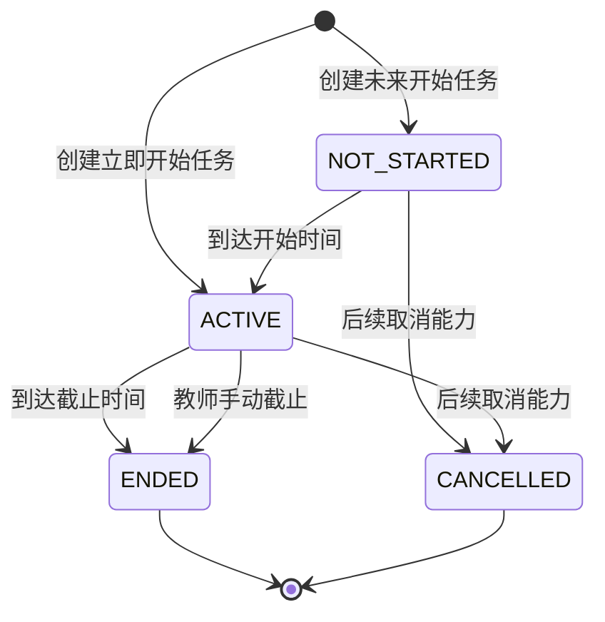
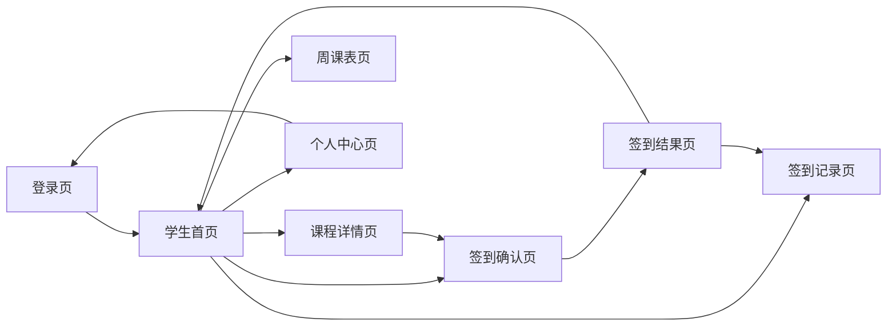
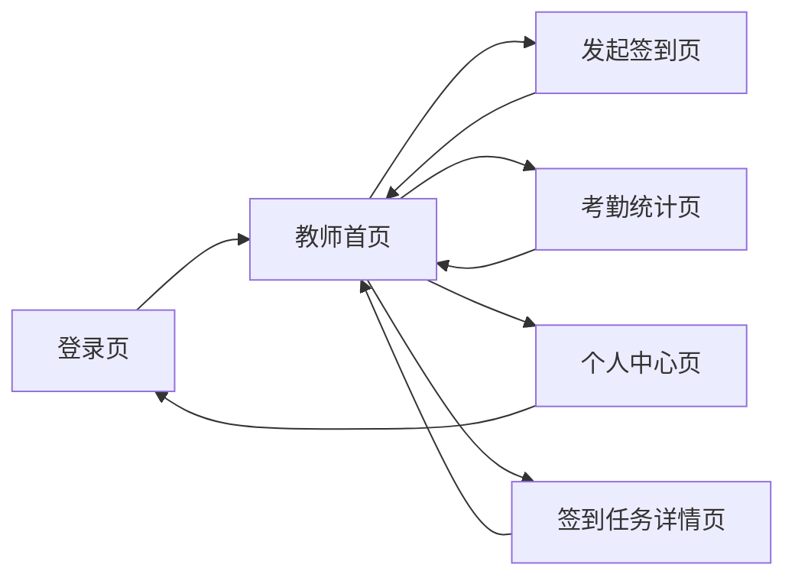
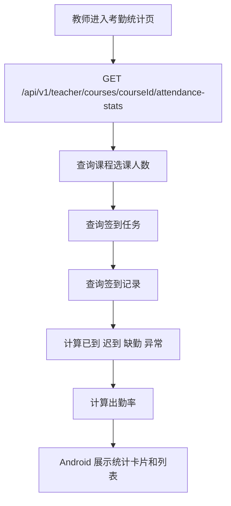
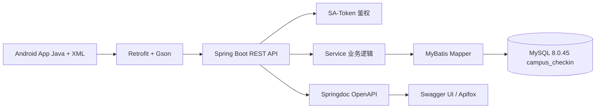

# CampusCheckin 智课签 PRD

**文档信息**

| 项目 | 内容 |
|---|---|
| 产品名称 | CampusCheckin / 智课签 |
| 项目主题 | 基于 Android 的校园课程考勤签到 APP 设计与实现 |
| 文档版本 | v1.2 |
| 文档状态 | 第一阶段开发与答辩版本 |
| 适用阶段 | 课程设计 / Android 实训 / 毕业设计原型 |
| 当前主视觉 | `docs/vercel/DESIGN.md` |
| 默认后端端口 | `8081` |
| Android 模拟器 API 地址 | `http://10.0.2.2:8081/api/v1/` |
| 后端本机 API 地址 | `http://localhost:8081/api/v1/` |
| 最近更新 | 2026-05-19 |

**版本记录**

| 版本 | 日期 | 说明 |
|---|---|---|
| v1.0 | 2026-05-17 | 明确 Android + Spring Boot + MySQL 真实数据库方案 |
| v1.1 | 2026-05-18 | 补充 Vercel 风格、Swagger / OpenAPI、教师手动截止 |
| v1.2 | 2026-05-19 | 按规范 PRD 扩写，加入流程图、用户故事、接口矩阵和验收用例 |

**PRD 写法参考**

| 来源 | 借鉴点 |
|---|---|
| [Atlassian PRD 说明](https://www.atlassian.com/agile/requirements) | PRD 应明确产品目的、核心功能、用户需求和成功标准 |
| [Confluence PRD 模板](https://www.atlassian.com/software/confluence/templates/product-requirements?category=services) | PRD 可包含假设、用户故事、UX / 交互、范围和重要性 |
| [Atlassian User Stories](https://www.atlassian.com/agile/project-management/user-stories) | 用户故事应从用户目标出发，并在开始开发前明确验收条件 |
| [Atlassian Acceptance Criteria](https://www.atlassian.com/work-management/project-management/acceptance-criteria) | 验收标准应清晰、可测试，并能映射到具体用例 |

**术语说明**

| 术语 | 说明 |
|---|---|
| 签到任务 | 教师在某门课程下创建的一次课堂签到活动，对应 `check_in_tasks` |
| 签到码 / 课堂口令 | 教师口头或屏幕展示给学生的短口令，第一阶段主要签到方式 |
| 当前可签到任务 | 当前学生已选课程中，处于可见时间窗口内且可操作的签到任务 |
| 已选课程 | 学生在 `course_enrollments` 中状态为 `ACTIVE` 的课程 |
| 手动截止 | 教师提前结束正在进行的签到任务，学生端立即不可继续提交 |
| 迟到 | 学生提交时间超过业务允许时间或被规则判定为迟到 |
| 缺勤 | 签到任务结束后，学生没有有效签到记录 |
| 异常 | 口令错误、重复提交、角色不匹配、未选课或任务状态异常等情况 |

## 1. 项目背景

高校课程考勤是课堂管理中的常见场景。传统点名、纸质签到或课后人工统计方式效率较低，容易出现遗漏、代签、统计不及时等问题。学生也很难快速确认自己某节课的签到状态，教师则需要花费额外时间整理课程出勤情况。

CampusCheckin / 智课签 是一个基于 Android 的校园课程考勤签到 APP，面向大学课程设计 / Android 实训项目。项目通过 Android 客户端、Spring Boot 后端和 MySQL 8.0.45 数据库完成学生签到、教师发起签到和考勤统计闭环。

本项目对标学习通的课堂签到活动模型：教师在某门课程下临时发布签到，学生端动态接收签到任务，完成签到后立即反馈状态，教师端可查看任务进度和课程维度统计。项目只借鉴签到业务流程，不复制学习通品牌、Logo、商标、专有插画或完整商业功能。

公开对标参考仅用于确认常见签到形态：多份高校学习通教师使用手册中提到普通签到、手势签到、位置签到、二维码签到等方式；部分使用说明还提到拍照签到和签到码。CampusCheckin 第一阶段只实现最适合课程设计演示的签到码 / 课堂口令流程，其余方式作为后续扩展。

## 2. 项目目标

本项目要解决校园课堂考勤流程中签到不便、统计低效和状态不透明的问题。

项目目标包括：

- 为学生提供课程查看、课程表查看、当前可签到任务查看、课堂口令签到和签到记录查询能力。
- 为教师提供课程管理视图、发起签到任务、手动截止签到和课程维度考勤统计能力。
- 使用 MySQL 保存核心业务数据，避免只停留在静态 mock 展示。
- 使用 Spring Boot 提供 REST API，Android 端通过接口访问真实数据。
- 使用简单清晰的技术架构，保证项目适合课程设计、实训演示和答辩讲解。

第一阶段成功标准：

- 教师能在任意授课课程下发布签到任务。
- 学生首页能聚合展示所有已选课程的当前可签到任务。
- 学生完成签到后，首页、课程详情和签到记录能同步更新状态。
- 教师能看到最近签到任务状态，并可手动截止进行中的签到。
- 课程统计能展示应到、已到、迟到、缺勤和出勤率。

## 3. 项目定位

本项目定位为适合课程设计 / Android 实训演示的校园考勤系统，不是正式上线的商业系统。

第一阶段重点是完成真实数据库版核心闭环：登录认证、课程查询、周课表、签到任务、学生签到、签到记录和教师统计。项目应避免过度复杂的架构和非必要第三方能力，但需要体现真实数据库、前后端分离接口和基础鉴权能力。

第一阶段定位：

| 维度 | 说明 |
|---|---|
| 项目类型 | Android 原生客户端 + Spring Boot 后端 + MySQL 数据库 |
| 复杂度 | 中等，适合课程设计和答辩演示 |
| 核心亮点 | 真实数据库、REST API、角色区分、签到任务闭环、统计展示 |
| 设计方向 | `docs/vercel/DESIGN.md`，clean / card-based / Vercel style |
| 实现原则 | 优先可运行、可讲解、可验证，不做过度工程化 |

第一阶段范围边界：

| 做 | 不做 |
|---|---|
| 学生 / 教师登录 | 管理员后台 |
| 课程列表和周课表 | 课程排课管理 |
| 当前可签到任务聚合 | 消息推送 |
| 签到码 / 课堂口令签到 | 二维码、定位、手势、拍照、蓝牙 / Wi-Fi 签到 |
| 教师发起签到和手动截止 | 复杂反作弊风控 |
| 课程维度统计 | Excel 导出 |

## 4. 用户角色

| 角色 | 主要目标 | 第一阶段权限 |
|---|---|---|
| 学生 | 快速看到当前要签到的课程，提交签到并确认结果 | 登录、查看课程、查看周课表、查看当前可签到任务、提交签到、查看记录、查看个人中心 |
| 教师 | 快速发起课堂签到，查看签到完成情况 | 登录、查看授课课程、创建签到任务、查看任务状态、手动截止、查看统计、查看个人中心 |

第一阶段不实现管理员角色。管理员后台、用户管理、课程维护和排课管理可作为后续扩展。

用户画像：

| 用户 | 场景 | 目标 |
|---|---|---|
| 软件工程学生林一凡 | 上课时教师口头公布签到码 | 打开 App 后马上看到当前签到任务，输入口令完成签到 |
| 任课教师李老师 | Java 程序设计课堂开始后需要快速考勤 | 选择课程发布签到，确认学生是否收到并能手动截止 |
| 答辩评委 / 老师 | 查看项目是否形成完整闭环 | 观察登录、发起签到、学生签到、统计查询是否贯通真实数据库 |

## 5. 用户痛点

学生痛点：

- 不清楚当前课程是否已经开放签到。
- 如果签到入口只藏在某门课程详情里，容易漏掉教师刚发布的其他课程签到。
- 课堂签到结果不透明，难以及时确认自己是否已签到、迟到或缺勤。
- 签到完成后如果首页状态不刷新，学生会误以为还没签到成功。
- 无法方便查看个人历史考勤记录。
- 传统纸质签到或点名流程耗时，体验较差。

教师痛点：

- 课堂点名占用教学时间。
- 纸质签到和手工统计效率低。
- 缺少课程维度的出勤数据汇总。
- 难以及时查看学生签到完成情况。
- 签到发布后，如果学生端没有明显入口，教师会误以为学生没有收到签到任务。
- 缺少可用于课程答辩展示的完整数字化考勤流程。

轻量竞品对标：

| 对标点 | 学习通常见体验 | CampusCheckin 第一阶段策略 |
|---|---|---|
| 签到发布 | 教师在课程活动中发布签到 | 教师在授课课程下创建签到任务 |
| 学生接收 | 学生端出现课程签到入口 | 学生首页聚合展示当前可签到任务 |
| 签到方式 | 普通、手势、二维码、位置、拍照、签到码等 | 只做签到码 / 课堂口令，其他作为后续扩展 |
| 状态反馈 | 学生可看到签到结果 | 签到结果页、首页卡片、课程详情、记录页同步状态 |
| 统计查看 | 教师查看活动完成情况 | 教师查看任务状态和课程维度统计 |

## 6. 核心功能范围

### 6.1 学生端功能

| 编号 | 功能 | 优先级 | 说明 |
|---|---|---|---|
| FR-STU-001 | 学生登录 | P0 | 使用账号、密码和学生角色登录 |
| FR-STU-002 | 查看课程列表 | P0 | 展示学生已选课程 |
| FR-STU-003 | 查看周课表 | P1 | 按星期和节次展示课程 |
| FR-STU-004 | 查看当前可签到任务 | P0 | 首页聚合所有已选课程的可签到任务 |
| FR-STU-005 | 课程详情 | P0 | 展示课程信息、当前签到任务和本人状态 |
| FR-STU-006 | 课堂口令签到 | P0 | 输入教师公布的签到码并提交 |
| FR-STU-007 | 签到结果 | P0 | 展示成功、迟到或失败原因 |
| FR-STU-008 | 签到记录 | P0 | 查看个人历史签到记录 |
| FR-STU-009 | 个人中心 | P1 | 展示当前用户信息和退出登录 |

### 6.2 教师端功能

| 编号 | 功能 | 优先级 | 说明 |
|---|---|---|---|
| FR-TEA-001 | 教师登录 | P0 | 使用账号、密码和教师角色登录 |
| FR-TEA-002 | 查看授课课程 | P0 | 展示教师负责的课程列表 |
| FR-TEA-003 | 发起签到任务 | P0 | 选择课程、标题、口令、开始时间和截止时间 |
| FR-TEA-004 | 查看最近签到任务 | P0 | 展示任务课程、时间和状态 |
| FR-TEA-005 | 手动截止签到 | P0 | 提前结束正在进行的签到任务 |
| FR-TEA-006 | 查看签到任务详情 | P0 | 查看某次签到的实时统计和学生明细，支持手动刷新和 10 秒轮询 |
| FR-TEA-007 | 查看课程统计 | P0 | 查看应到、已到、迟到、缺勤和出勤率 |
| FR-TEA-008 | 查看个人中心 | P1 | 展示教师信息和退出登录 |

### 6.3 通用功能

| 编号 | 功能 | 优先级 | 说明 |
|---|---|---|---|
| FR-AUTH-001 | 统一登录入口 | P0 | 登录页区分学生 / 教师角色 |
| FR-AUTH-002 | Token 鉴权 | P0 | 后端使用 SA-Token，Android 请求携带 Authorization |
| FR-AUTH-003 | 退出登录 | P1 | 清除本地 session 并回到登录页 |
| FR-SYS-001 | 统一响应结构 | P0 | `ApiResponse { code, message, data }` |
| FR-SYS-002 | 动态 OpenAPI | P1 | 支持 Swagger UI 和 Apifox 导入 |

学习通对标后的签到产品原则：

- 签到是教师临时发布的课程活动，不是固定写死在某一门课上的静态按钮。
- 学生首页必须优先展示“当前可签到任务”，而不是只展示某一门默认课程。
- 同一时间如果多门课程都有签到任务，学生应看到多个可签到入口，并按课程名称、教师、截止时间区分。
- 学生只能看到自己已选课程下的签到任务，不能看到未选课程或其他教师课程的任务。
- 签到完成后，首页任务卡、课程详情、签到结果页和签到记录页必须同步显示已签到或迟到状态。
- 教师创建签到后，应能看到任务是否未开始、进行中、已截止，以及学生完成情况。

### 6.4 用户故事与验收标准

| 编号 | 用户故事 | 验收标准 |
|---|---|---|
| US-001 | 作为学生，我希望登录后立即看到当前可签到任务，以便不漏掉老师刚发布的签到 | 首页展示所有已选课程的当前可签到任务；没有任务时显示空状态；不能只展示固定课程 |
| US-002 | 作为学生，我希望输入课堂口令完成签到，以便确认本节课考勤状态 | 口令正确且任务可签到时写入 `check_in_records`；重复提交被拦截；结果页展示状态 |
| US-003 | 作为学生，我希望签到完成后首页状态立即变化，以便确认自己已经签到 | 返回首页或课程详情时重新拉取任务和记录；按钮变为已完成或任务移出待签到列表 |
| US-004 | 作为教师，我希望选择课程发起签到，以便快速开始课堂考勤 | 教师只能对自己的课程创建任务；创建后写入 `check_in_tasks`；教师首页能看到新任务 |
| US-005 | 作为教师，我希望手动截止签到，以便课堂提前结束时关闭入口 | 只允许截止自己的进行中任务；截止后状态为 `ENDED`；学生端不可继续签到 |
| US-006 | 作为教师，我希望点进某次签到看到学生名单，以便确认谁已经签到、谁还未签到 | 任务详情页展示学生姓名、学号、班级、状态和签到时间；页面支持手动刷新和自动刷新 |
| US-007 | 作为教师，我希望查看课程统计，以便掌握学生出勤情况 | 统计展示应到、已到、迟到、缺勤、异常和出勤率 |
| US-008 | 作为答辩演示者，我希望用一组账号跑通闭环，以便证明系统不是静态 mock | 使用初始化数据登录教师发起签到，学生登录完成签到，教师刷新统计可看到变化 |

## 7. 第一阶段功能

第一阶段功能要求容易实现、适合 Java + XML + Spring Boot + MySQL 的课程项目。

第一阶段实现内容：

- 统一登录页，支持学生和教师登录。
- 后端使用 SA-Token 完成登录鉴权和 token 管理。
- 用户密码使用 BCrypt 加密存储。
- Android 端通过 Retrofit + Gson 调用后端接口。
- 学生首页优先展示当前可签到任务列表，并展示课程入口和周课表入口。
- 当前可签到任务必须按学生选课关系查询，不能写死为 Android 应用开发或任意单门课程。
- 周课表页按周一到周五和节次展示课程。
- 课程详情页展示课程名称、教师、地点、上课时间、当前签到任务和学生本人签到状态。
- 签到确认页支持输入课堂口令并提交签到。
- 签到结果页展示签到成功、迟到、缺勤或异常提示，并返回后触发首页和课程详情状态刷新。
- 签到记录页展示学生个人历史签到记录。
- 教师首页展示授课课程和签到管理入口。
- 教师首页展示最近签到任务、任务状态、已签 / 应到摘要、查看明细和手动截止入口。
- 教师发起签到页支持通过日期时间选择器创建签到任务。
- 签到任务详情页展示实时统计和学生签到明细，支持手动刷新和 10 秒自动刷新。
- 考勤统计页按课程展示应到、已到、迟到、缺勤和出勤率。
- 个人中心页展示当前用户基本信息和退出登录入口。

第一阶段需要补齐的学生签到任务接口能力：

- `GET /api/v1/student/check-in-tasks/active`：查询当前学生所有已选课程中正在进行或即将开始的签到任务。
- 返回数据应包含 `taskId`、`courseId`、`courseName`、`teacherName`、`title`、`checkInType`、`startTime`、`endTime`、`taskStatus`、`recordStatus`、`signed`。
- 学生首页应优先消费该接口；如果没有该接口，Android 也必须通过课程列表逐门查询任务并聚合展示，不能只显示第一门课的签到。
- 例如李老师发布 `Java程序设计` 签到时，选修该课程的学生账号必须在首页看到 Java 签到任务；未选修该课程的学生不能看到该任务。

功能需求明细：

| 编号 | 输入 | 输出 | 前置条件 | 异常情况 |
|---|---|---|---|---|
| FR-AUTH-001 | 账号、密码、角色 | token、用户信息、角色 | 用户存在且启用 | 密码错误、角色不匹配、账号禁用 |
| FR-STU-004 | 学生 token | 当前可签到任务列表 | 学生已登录且存在选课关系 | 无任务、token 失效、接口失败 |
| FR-STU-006 | taskId、password | 签到记录和结果状态 | 任务可签到且学生已选课 | 口令错误、重复签到、未开始、已截止 |
| FR-TEA-003 | courseId、title、password、startTime、endTime | 签到任务 | 教师已登录且拥有课程 | 时间无效、课程不属于教师 |
| FR-TEA-005 | taskId | 截止后的签到任务 | 任务属于当前教师且状态为 ACTIVE | 任务不存在、无权操作、已截止 |
| FR-STAT-001 | courseId | 课程签到统计 | 教师拥有该课程 | 课程无任务、无权访问 |

第一阶段主流程必须使用真实后端接口和 MySQL 数据库。Android 端可以保留少量 mock data 作为离线兜底或 UI 预览，但不能作为主数据源。

## 8. 后续扩展功能

后续可扩展功能包括：

- 二维码签到。
- 定位签到。
- 手势签到。
- 拍照签到。
- 普通一键签到。
- 动态签到码。
- 蓝牙 / Wi-Fi 签到。
- 管理员后台。
- 课程和用户管理。
- 消息通知。
- 考勤导出。
- 异常申诉。
- 学生维度统计。
- 签到记录筛选和搜索。
- Redis 缓存或分布式会话。
- 更完整的权限管理。

扩展功能优先级建议：

| 阶段 | 功能 | 说明 |
|---|---|---|
| 第二阶段 | 二维码签到、导出统计、签到记录筛选 | 展示效果明显，适合继续完善 |
| 第三阶段 | 定位签到、异常申诉、消息通知 | 需要权限和更复杂状态处理 |
| 第四阶段 | 管理员后台、排课管理、复杂反作弊 | 更接近正式系统，不作为第一阶段重点 |

## 9. 页面清单

| 页面名称 | 使用角色 | 页面目的 | 核心内容 | 第一阶段实现 | 关键状态 |
|---|---|---|---|---|---|
| 登录页 | 学生 / 教师 | 用户登录并区分角色 | 账号、密码、角色、登录按钮 | 是 | 空输入、密码错误、角色错误、登录中 |
| 学生首页 | 学生 | 展示学生主要功能入口 | 当前可签到任务、课程入口、周课表入口、出勤率概览 | 是 | 有任务、无任务、已签到、加载失败 |
| 当前签到任务列表 | 学生 | 防止漏掉任意课程签到 | 课程名、教师、签到标题、截止时间、本人状态、立即签到按钮 | 是，集成在学生首页 | 多任务、任务截止、已完成 |
| 周课表页 | 学生 | 查看一周课程安排 | 周一到周五、节次、课程卡片 | 是 | 无课程、加载失败 |
| 课程详情页 | 学生 | 查看课程信息和签到入口 | 课程信息、教师、地点、当前签到任务、本人签到状态 | 是 | 无任务、可签到、已签到、已截止 |
| 签到确认页 | 学生 | 提交课堂签到 | 课堂口令输入、签到按钮 | 是 | 口令为空、提交中、口令错误、重复签到 |
| 签到结果页 | 学生 | 展示签到结果 | 已签到、迟到、失败原因 | 是 | 成功、迟到、失败 |
| 签到记录页 | 学生 | 查看个人考勤历史 | 课程、时间、状态列表 | 是 | 无记录、加载失败 |
| 教师首页 | 教师 | 展示教师课程和签到任务管理入口 | 最近签到任务、任务状态、手动截止、课程列表、发起签到入口 | 是 | 无任务、进行中、已截止、加载失败 |
| 签到任务详情页 | 教师 | 查看某次签到的实时完成情况 | 任务信息、统计汇总、学生明细、刷新、手动截止 | 是 | 进行中、已截止、无学生、加载失败 |
| 教师发起签到页 | 教师 | 创建签到任务 | 课程选择、日期时间选择器、课堂口令 | 是 | 时间无效、课程未选、创建中、创建失败 |
| 考勤统计页 | 教师 | 查看课程考勤结果 | 应到、已到、迟到、缺勤、出勤率 | 是 | 无任务、统计为空、加载失败 |
| 个人中心页 | 学生 / 教师 | 查看用户信息 | 姓名、学号/工号、角色、退出登录 | 是 | 未登录、退出确认 |
| 管理员页面 | 管理员 | 管理用户和课程 | 用户管理、课程管理 | 否 | 后续扩展 |
| 二维码签到页 | 学生 / 教师 | 扫码或展示二维码签到 | 二维码生成、扫码 | 否 | 后续扩展 |
| 定位签到页 | 学生 | 校验位置签到 | 定位权限、距离判断 | 否 | 后续扩展 |

页面状态说明：

| 状态 | 展示规则 |
|---|---|
| 加载中 | 显示轻量 loading 或禁用按钮，避免重复点击 |
| 空状态 | 用明确文案说明“暂无可签到任务”或“暂无记录” |
| 接口失败 | 显示失败提示，允许用户返回或重试，不伪造成真实数据 |
| 未登录 | 清理本地 token 并返回登录页 |
| 无可签到任务 | 学生首页仍展示课程入口和周课表入口 |
| 已签到 | 签到按钮变为已完成，不允许重复提交 |
| 任务截止 | 学生端不展示“立即签到”，教师端展示已截止 |

## 10. 业务流程

### 10.1 登录与角色分流流程

### 10.2 学生接收并完成签到流程

### 10.3 教师发起签到流程

### 10.4 教师手动截止流程

### 10.5 签到任务状态流转图

### 10.6 学生端页面跳转图

### 10.7 教师端页面跳转图

### 10.8 考勤统计生成流程

## 11. 签到状态规则

| 状态 | 英文字段 | 说明 | 学生端表现 | 教师端表现 |
|---|---|---|---|---|
| 未开始 | NOT_STARTED | 当前时间早于签到任务开始时间 | 可看到任务但不能提交，或显示未开始 | 显示未开始 |
| 可签到 | ACTIVE | 当前时间在签到开始时间和截止时间之间 | 显示立即签到按钮 | 可手动截止 |
| 已签到 | SIGNED | 学生已在有效时间内完成签到 | 显示已完成，不允许重复提交 | 统计为已到 |
| 迟到 | LATE | 学生在规则允许的迟到范围内提交，或后端判断为迟到 | 显示迟到状态 | 统计为迟到 |
| 缺勤 | ABSENT | 签到截止后学生没有有效签到记录 | 记录页显示缺勤 | 统计为缺勤 |
| 异常 | EXCEPTION | 口令错误、角色不匹配、数据异常等 | 显示失败原因 | 不计入正常签到 |
| 已截止 | ENDED | 签到任务结束或被手动截止 | 不允许继续签到 | 可查看统计 |
| 已取消 | CANCELLED | 签到任务被取消 | 不显示可操作入口 | 后续扩展 |

第一阶段签到方式为签到码 / 课堂口令 + 按钮确认。二维码、定位、手势、拍照、蓝牙和 Wi-Fi 签到不在第一阶段实现。

签到任务可见性规则：

- 学生只能看到自己选课范围内的签到任务。
- 学生首页的当前签到任务列表必须聚合所有已选课程，不能只取第一门课程或写死课程名称。
- 任务 `status=ACTIVE` 且当前时间在 `startTime` 到 `endTime` 之间时，才可提交签到。
- 任务手动截止后，即使原截止时间未到，也不能继续签到。
- 学生已经有 `SIGNED` 或 `LATE` 记录时，按钮应变为已完成状态，不能重复提交。
- 任务截止后，未产生有效签到记录的学生在统计中记为缺勤。

异常规则：

| 场景 | 处理规则 |
|---|---|
| 未登录访问接口 | 返回 401，Android 返回登录页 |
| 学生访问教师接口 | 返回权限错误 |
| 教师操作其他教师课程 | 拒绝操作 |
| 学生未选该课程 | 不展示任务，提交时也拒绝 |
| 口令错误 | 不写入成功记录，提示口令错误 |
| 重复签到 | 不重复写入，提示请勿重复签到 |
| 任务已截止 | 不允许提交，提示签到已结束 |

## 12. 数据模型

### User

| 字段名 | 类型 | 说明 |
|---|---|---|
| userId | Long | 用户 ID |
| username | String | 登录账号 |
| passwordHash | String | BCrypt 加密后的密码 |
| role | String | 用户角色：STUDENT 或 TEACHER |
| status | String | 账号状态：ENABLED 或 DISABLED |
| lastLoginAt | DateTime | 最后登录时间 |
| createdAt | DateTime | 创建时间 |
| updatedAt | DateTime | 更新时间 |

### Student

| 字段名 | 类型 | 说明 |
|---|---|---|
| studentId | Long | 学生 ID |
| userId | Long | 关联 users 表 ID |
| studentNo | String | 学号 |
| name | String | 学生姓名 |
| className | String | 班级名称 |
| major | String | 专业 |
| phone | String | 联系方式 |
| avatarText | String | 头像占位文字 |

### Teacher

| 字段名 | 类型 | 说明 |
|---|---|---|
| teacherId | Long | 教师 ID |
| userId | Long | 关联 users 表 ID |
| teacherNo | String | 教师工号 |
| name | String | 教师姓名 |
| department | String | 所属院系 |
| title | String | 职称 |
| phone | String | 联系方式 |
| avatarText | String | 头像占位文字 |

### Course

| 字段名 | 类型 | 说明 |
|---|---|---|
| courseId | Long | 课程 ID |
| courseCode | String | 课程编号 |
| courseName | String | 课程名称 |
| teacherId | Long | 授课教师 ID |
| location | String | 上课地点 |
| weekDay | int | 星期几，1 表示周一 |
| section | String | 上课节次 |
| startTime | String | 上课开始时间 |
| endTime | String | 上课结束时间 |
| semester | String | 学期 |
| credit | Decimal | 学分 |
| status | String | 课程状态：ACTIVE 或 ARCHIVED |

### CourseEnrollment

| 字段名 | 类型 | 说明 |
|---|---|---|
| enrollmentId | Long | 选课关系 ID |
| courseId | Long | 课程 ID |
| studentId | Long | 学生 ID |
| enrolledAt | DateTime | 选课时间 |
| status | String | 选课状态：ACTIVE 或 DROPPED |

### CheckInTask

| 字段名 | 类型 | 说明 |
|---|---|---|
| taskId | Long | 签到任务 ID |
| courseId | Long | 关联课程 ID |
| title | String | 签到任务标题 |
| checkInType | String | 签到方式：PASSWORD、NORMAL、QR_CODE、LOCATION、GESTURE、PHOTO；第一阶段可先固定为 PASSWORD |
| password | String | 课堂口令 |
| startTime | DateTime | 签到开始时间 |
| endTime | DateTime | 签到截止时间 |
| status | String | 任务状态：NOT_STARTED、ACTIVE、ENDED、CANCELLED |
| createdBy | Long | 发起教师 ID |
| createdAt | DateTime | 创建时间 |
| updatedAt | DateTime | 更新时间 |

### CheckInRecord

| 字段名 | 类型 | 说明 |
|---|---|---|
| recordId | Long | 签到记录 ID |
| taskId | Long | 关联签到任务 ID |
| courseId | Long | 关联课程 ID |
| studentId | Long | 学生 ID |
| checkInTime | DateTime | 签到时间 |
| status | String | 签到状态：SIGNED、LATE、ABSENT、EXCEPTION |
| remark | String | 备注信息 |
| createdAt | DateTime | 创建时间 |
| updatedAt | DateTime | 更新时间 |

### ActiveCheckInTask

学生首页聚合展示使用的响应模型，不一定需要单独建表。

| 字段名 | 类型 | 说明 |
|---|---|---|
| taskId | Long | 签到任务 ID |
| courseId | Long | 课程 ID |
| courseName | String | 课程名称 |
| teacherName | String | 授课教师 |
| title | String | 签到标题 |
| checkInType | String | 签到方式，第一阶段主要为 PASSWORD |
| startTime | DateTime | 开始时间 |
| endTime | DateTime | 截止时间 |
| taskStatus | String | 任务状态：NOT_STARTED、ACTIVE、ENDED、CANCELLED |
| recordStatus | String | 当前学生的签到状态：UNSIGNED、SIGNED、LATE、ABSENT、EXCEPTION |
| signed | boolean | 当前学生是否已经完成有效签到 |

数据库说明：

- 当前建库、建表和初始化演示数据维护在 `docs/schema.sql`。
- 数据库名为 `campus_checkin`。
- 第一阶段已经包含 `users`、`students`、`teachers`、`courses`、`course_enrollments`、`check_in_tasks`、`check_in_records`。
- 如果后续实现 `checkInType` 持久化，应在 `check_in_tasks` 中补充 `check_in_type` 字段，并同步更新 `docs/schema.sql`、实体、DTO 和 OpenAPI。

## 13. 非功能需求

易用性：

- 学生和教师入口清晰。
- 签到状态使用明确文字和颜色区分。
- 当前可签到任务在学生首页第一屏可见，避免学生必须逐门课程寻找签到入口。
- 签到流程不超过三步：看到任务、输入口令、查看结果。
- 教师发起签到表单字段保持简单。
- 教师发起签到时间通过日期时间选择器完成，避免手动输入格式错误。

可维护性：

- Android 端按 Activity、Adapter、Model、Network、Data 等包分层。
- Spring Boot 后端按 Controller、Service、Mapper、Entity、DTO 等包分层。
- SQL 表结构清晰，字段命名统一。
- API 返回结构统一，便于 Android 端处理成功和失败状态。
- 所有接口变更需要同步 `docs/API.md` 和动态 OpenAPI 注解。

页面一致性：

- 遵守 `docs/vercel/DESIGN.md` 的当前视觉方向，并适配校园考勤场景。
- 使用 clean / card-based / Vercel style。
- 课程、签到任务和统计信息使用卡片式布局。
- 颜色、间距、文字应放入 Android 资源文件管理。
- 不复制任何品牌 Logo、商标、专有插画。

演示友好性：

- 支持通过初始化数据快速登录学生和教师账号。
- 支持在本地 MySQL 8.0.45 中导入演示数据。
- 支持 Android 模拟器访问本机 Spring Boot 后端。
- 支持 Apifox 通过 OpenAPI 动态导入接口。
- 核心流程可在答辩现场完整演示。

安全性与权限：

- Android 不直连 MySQL。
- 所有需要登录的接口必须校验 token。
- 学生不能访问教师接口。
- 教师不能操作其他教师课程下的签到任务。
- 密码仅保存 BCrypt hash，不保存明文。

性能与稳定性：

- 第一阶段数据量较小，接口响应以简单 SQL 查询为主。
- 学生首页当前签到任务查询需要支持多课程聚合，避免前端逐门课程过多请求成为长期方案。
- 接口失败时 Android 应提示失败并允许重试，不能展示“伪成功”。

## 14. 技术实现说明

### 14.1 系统架构图

Android 客户端采用：

- Java 编写 Activity 和业务逻辑。
- XML Layout 编写页面布局。
- AppCompat 提供基础兼容能力。
- Material Components 提供按钮、输入框、卡片等 UI 组件。
- ConstraintLayout 负责页面布局。
- RecyclerView 展示课程列表、签到任务列表、签到记录和统计列表。
- Retrofit + Gson 调用 Spring Boot REST API。
- Gradle Kotlin DSL 管理构建配置。

后端服务采用：

- Spring Boot 提供 REST API。
- Java 编写 Controller、Service、Mapper 和业务逻辑。
- Gradle Kotlin DSL 管理 server 模块。
- MyBatis 访问 MySQL。
- MySQL 8.0.45 保存核心业务数据。
- SA-Token 负责登录鉴权和 token 管理。
- BCrypt 负责密码加密和校验。
- Springdoc OpenAPI 提供动态 Swagger / OpenAPI 文档，方便 Apifox 导入和接口管理。

接口规则：

- REST API 统一前缀为 `/api/v1`。
- API 统一返回 `ApiResponse { code, message, data }`。
- Android 模拟器默认 baseUrl 为 `http://10.0.2.2:8081/api/v1/`。
- 后端本机浏览器、PowerShell、Apifox 测试可使用 `http://localhost:8081/api/v1/`。
- 动态 OpenAPI JSON 默认地址为 `http://localhost:8081/v3/api-docs`。
- Swagger UI 默认地址为 `http://localhost:8081/swagger-ui.html`。
- Android 不允许直连 MySQL，必须通过 Spring Boot 后端访问数据库。

接口矩阵：

| 页面 / 场景 | 方法 | 路径 | 角色 | 用途 | 状态刷新关系 |
|---|---|---|---|---|---|
| 登录页 | POST | `/api/v1/auth/login` | 学生 / 教师 | 登录并获取 token | 成功后进入对应首页 |
| 个人中心 | GET | `/api/v1/auth/me` | 学生 / 教师 | 获取当前用户信息 | 页面进入时加载 |
| 退出登录 | POST | `/api/v1/auth/logout` | 学生 / 教师 | 退出登录 | 成功后回登录页 |
| 学生首页 | GET | `/api/v1/student/courses` | 学生 | 获取已选课程 | 首页和课程入口刷新 |
| 学生首页 | GET | `/api/v1/student/check-in-tasks/active` | 学生 | 获取所有当前可签到任务 | 首页第一屏核心数据 |
| 周课表页 | GET | `/api/v1/student/schedule` | 学生 | 获取周课表 | 页面进入时加载 |
| 课程详情页 | GET | `/api/v1/courses/{courseId}` | 学生 / 教师 | 获取课程详情 | 页面进入时加载 |
| 课程详情页 | GET | `/api/v1/courses/{courseId}/active-check-in-task` | 学生 / 教师 | 获取课程当前签到任务 | 课程详情页刷新 |
| 签到确认页 | POST | `/api/v1/student/check-in` | 学生 | 提交签到 | 成功后刷新首页、详情、记录 |
| 签到记录页 | GET | `/api/v1/student/check-in-records` | 学生 | 获取个人签到记录 | 页面进入或签到后刷新 |
| 教师首页 | GET | `/api/v1/teacher/courses` | 教师 | 获取授课课程 | 首页课程列表刷新 |
| 教师首页 | GET | `/api/v1/teacher/check-in-tasks` | 教师 | 获取教师签到任务 | 创建和截止后刷新 |
| 发起签到页 | POST | `/api/v1/teacher/check-in-tasks` | 教师 | 创建签到任务 | 成功后教师首页刷新，学生首页可见 |
| 教师首页 | POST | `/api/v1/teacher/check-in-tasks/{taskId}/end` | 教师 | 手动截止签到任务 | 成功后学生端不可继续签到 |
| 签到任务详情页 | GET | `/api/v1/teacher/check-in-tasks/{taskId}/detail` | 教师 | 获取某次签到统计和学生明细 | 手动刷新、10 秒轮询和截止后刷新 |
| 考勤统计页 | GET | `/api/v1/teacher/courses/{courseId}/attendance-stats` | 教师 | 获取课程考勤统计 | 任务截止或签到后刷新 |

学生端签到接口要求：

- 学生首页优先调用 `GET /api/v1/student/check-in-tasks/active` 获取所有可见签到任务。
- 如果暂未实现聚合接口，Android 端必须临时通过课程列表逐门请求课程签到任务并聚合，作为过渡方案。
- 课程详情页可以继续调用课程维度的当前签到任务接口，但首页不能依赖单个固定课程。
- 提交签到成功后，Android 必须重新拉取当前签到任务和个人签到记录。

## 15. 验收标准

项目完成后应达到以下效果：

基础运行：

- 可以启动 Spring Boot 后端并连接 MySQL 8.0.45。
- 可以通过初始化数据登录学生账号和教师账号。
- Android 端登录成功后能保存并携带 SA-Token 返回的 token。
- Swagger UI 可通过 `http://localhost:8081/swagger-ui.html` 打开。
- Apifox 可导入 `http://localhost:8081/v3/api-docs`。

学生端验收：

- 学生可以查看课程列表、周课表和课程详情。
- 学生首页能展示所有已选课程中的当前可签到任务。
- 当李老师发布 `Java程序设计` 签到时，选修该课程的学生能在首页看到 Java 签到任务。
- 未选修 `Java程序设计` 的学生不能看到该课程签到任务。
- 学生可以输入课堂口令完成签到。
- 学生签到后，后端能写入或更新 MySQL 中的签到记录。
- 学生签到后，首页任务卡、课程详情和签到记录能同步显示已签到或迟到状态。
- 学生可以查看个人签到记录。

教师端验收：

- 教师可以查看自己的课程列表。
- 教师可以发起任意自己授课课程的签到任务。
- 教师可以查看最近签到任务状态。
- 教师可以点击最近签到任务进入详情页，看到学生姓名、学号、班级、状态和签到时间。
- 签到任务详情页支持手动刷新和 10 秒自动刷新。
- 教师可以手动截止正在进行的签到任务。
- 教师可以查看课程维度考勤统计。
- 统计结果能体现应到、已到、迟到、缺勤、异常和出勤率。

UI 和技术验收：

- 页面风格统一，符合校园考勤 APP 场景。
- 项目使用 Java + XML 实现 Android 页面，不使用 Jetpack Compose。
- 当前主视觉遵守 `docs/vercel/DESIGN.md`。
- 第一阶段不实现管理员端、二维码签到、定位签到、蓝牙/Wi-Fi 签到、消息推送和考勤导出。

答辩演示脚本：

| 步骤 | 操作 | 预期结果 |
|---|---|---|
| 1 | 启动 MySQL，导入 `docs/schema.sql` | 数据库 `campus_checkin` 和演示数据可用 |
| 2 | 启动后端 `.\gradlew.bat :server:bootRun --args="--server.port=8081"` | 后端运行在 8081 |
| 3 | 打开 Swagger UI 或 Apifox | 能看到接口文档 |
| 4 | 教师 `t20260001 / 123456` 登录 | 进入教师首页 |
| 5 | 李老师选择 `Java程序设计` 发起签到 | 教师首页出现新任务 |
| 6 | 学生 `s20260001 / 123456` 登录 | 学生首页看到 Java 签到任务 |
| 7 | 学生输入教师设置的口令签到 | 签到成功并写入数据库 |
| 8 | 学生返回首页和记录页 | 状态显示已签到 |
| 9 | 教师手动截止任务 | 任务状态变为已截止 |
| 10 | 教师查看 Java 课程统计 | 已到、迟到、缺勤和出勤率更新 |

验收用例：

| 用例 | 前置条件 | 操作 | 预期结果 |
|---|---|---|---|
| AC-001 学生登录 | 学生账号存在 | 输入 `s20260001 / 123456` 并选择学生 | 登录成功进入学生首页 |
| AC-002 教师登录 | 教师账号存在 | 输入 `t20260001 / 123456` 并选择教师 | 登录成功进入教师首页 |
| AC-003 Java 签到可见 | 李老师创建 Java 签到 | 学生 `s20260001` 打开首页 | 首页显示 Java 签到任务 |
| AC-004 未选课不可见 | 学生未选 Java 课程 | 学生 `s20260004` 打开首页 | 不显示 Java 签到任务 |
| AC-005 正常签到 | 任务 ACTIVE 且口令正确 | 学生提交口令 | 生成 SIGNED 记录 |
| AC-006 口令错误 | 任务 ACTIVE | 学生提交错误口令 | 不生成成功记录，提示错误 |
| AC-007 重复签到 | 已存在有效记录 | 学生再次提交 | 拦截重复签到 |
| AC-008 手动截止 | 任务 ACTIVE | 教师点击手动截止 | 任务变为 ENDED，学生不可继续签到 |
| AC-009 统计刷新 | 存在签到记录 | 教师进入统计页 | 统计数量和出勤率与数据库一致 |
